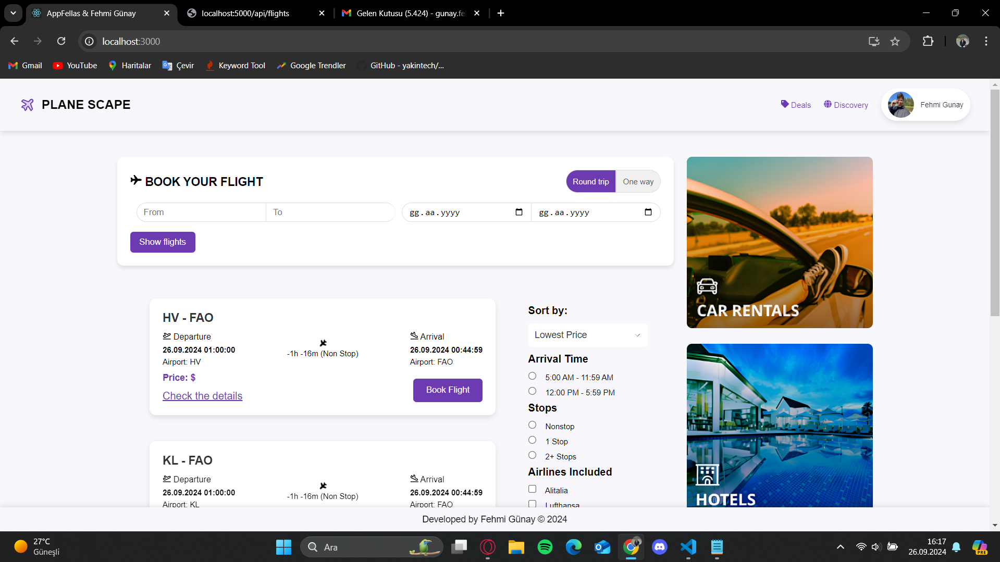
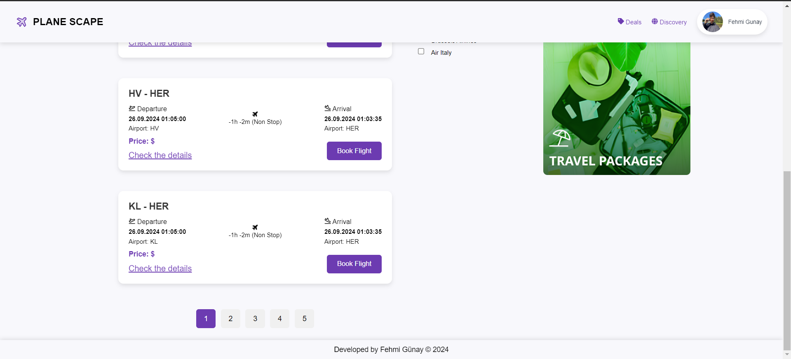
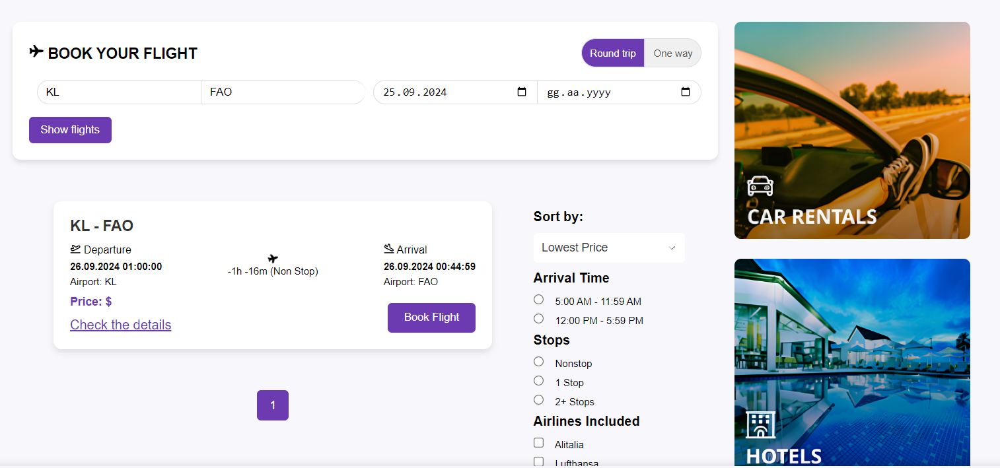
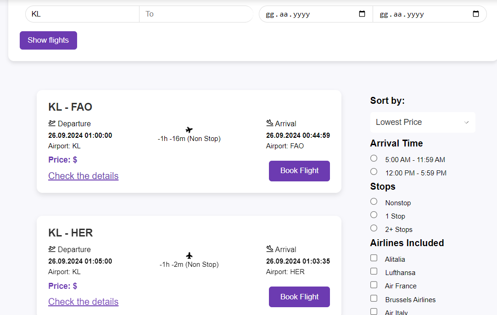
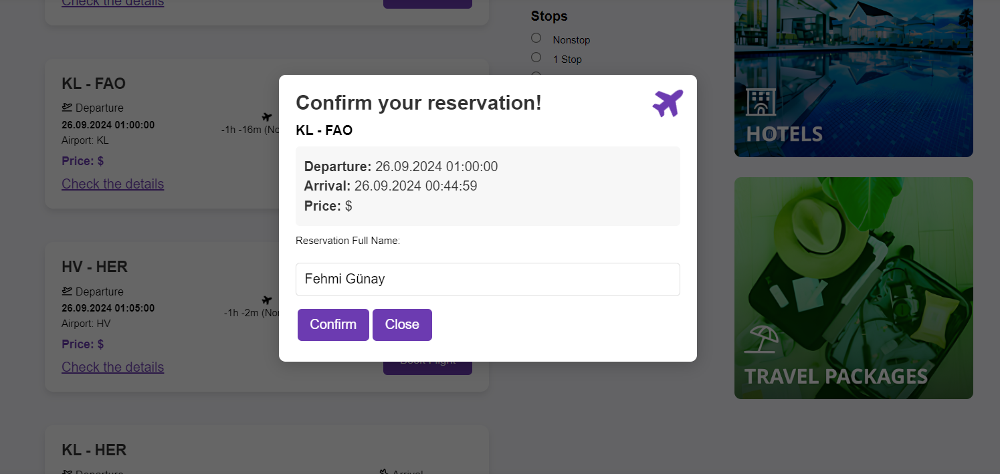
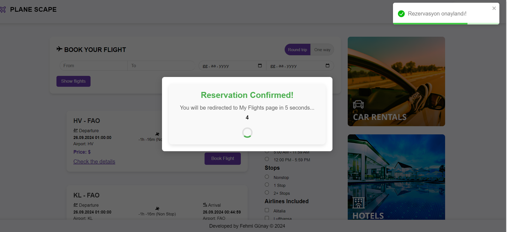
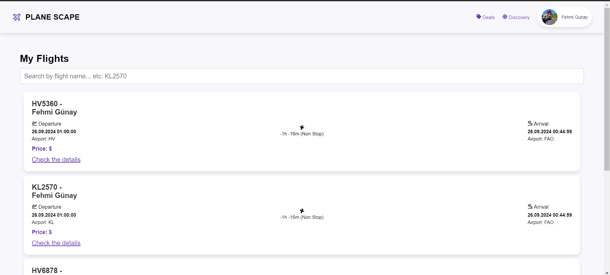
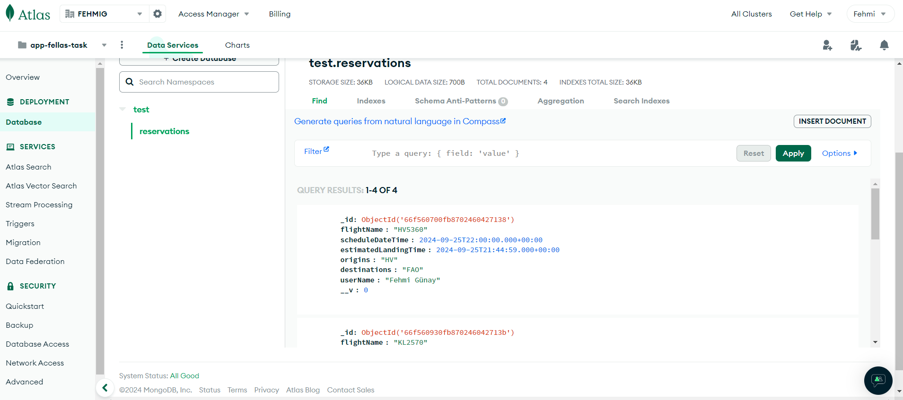
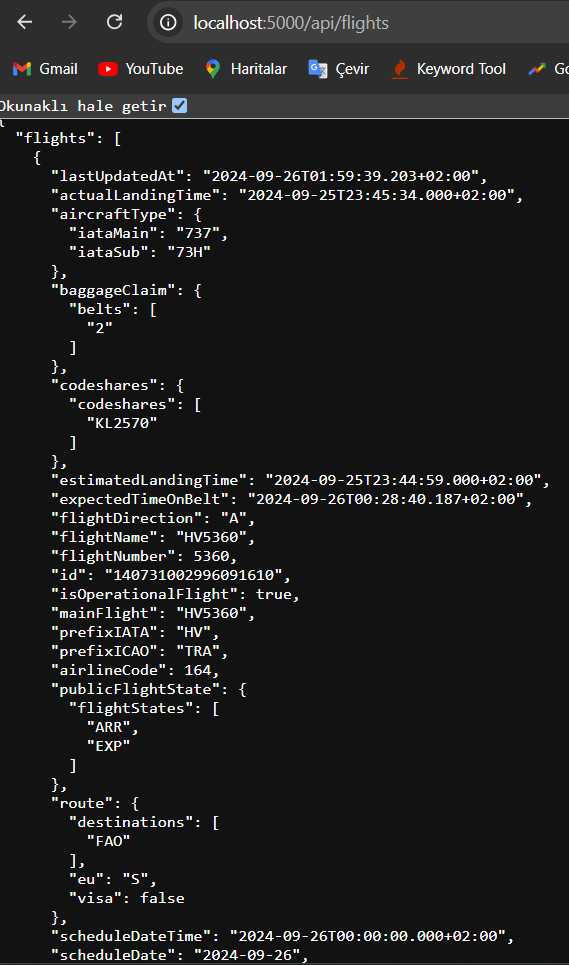

# AppFellas Proje - Flight Booking App

Uygulama AppFellas firması için proje geliştirme aşamasında geliştirilmiştir. Uygulamanın amacı Bir havalimanı
API’si ile basitçe uçuş bilgilerinin listelenebilmesi ve kullanıcı uçuş bilgilerinin basitçe
kaydedilmesini sağlayacak bir web uygulaması oluşturulmasıdır. Uygulamanın ara yüzü React ile geliştirilmiştir. Server kısmı için Node.js - Express kullanılmıştır. Veriler MongoDB üzerinde tutulup, kullanılmıştır.

State yönetimi için Redux kullanılmıştır. redux, react-redux, redux-thunk, @redux-devtools/extension kütüphaneleri ile mimari başarılı bir şekilde oluşturulmuştur.

Ara yüz iyileştirmeleri için CSS kodlarına ek olarak uyarı-bildirim bileşenleri için react-toastify kütüphanesi kullanılmıştır. Animatik ikonlar CSS kodları ile oluşturulmuştur. Tasarım responsive olarak kodlanmıştır, mobil görünüm için uygundur.

Server kısmı MVC yapısına uygun olarak kodlanmıştır.

## Görseller

Ana ekran görünümü.

Ana ekran görünümü (devam).

Filtreleme işlemleri.

Filtreleme işlemleri.

Rezervasyon yapmak için uçuş seçinde çıkan onaylama modalı.

Rezervasyon onaylanınca çıkan yönlendirme modal içeriği.

Rezervasyon yapılan uçuşların listelendiği "Uçuşlarım" ekranı.

Rezervasyonların kaydedildiği veritabanı.

Uçuşların listelendiği API.

## NOT

Uçuşlara ait bilgiler API de yer alan bilgilerle kısıtlanmak zorunda kalmıştır, özel durumlardan dolayı proje 2 gün içerisinde tamamlanmış olup API kullanımında problem yaşanmıştır. API'den ulaşılan bilgiler görsellere eklenmiştir, sadece bu bilgiler kullanılabilmiştir. Örneğin origin bilgisi isim olarak alınamamış kalkış ve varış havalimanı kodları kullanılarak bir mantık oluşturulmaya çalışılmıştır. Uçuşlara ait fiyat bilgisine ulaşılamamıştır.
Dolayısıyla filtreleme işlemleri kalkış-varış ve uçuş tarihleri üzerinden yapılabilmektedir.
